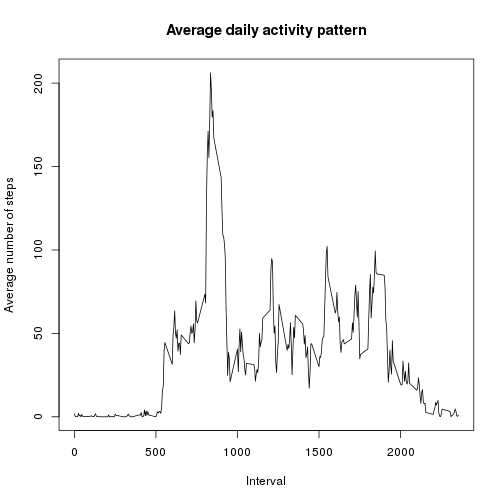
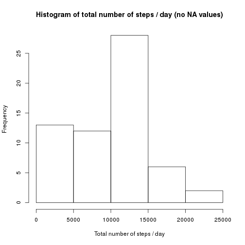
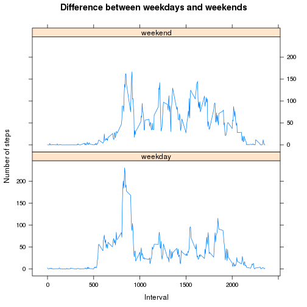

Load package for data processing...


```r
library("dplyr")
```

```
## 
## Attaching package: 'dplyr'
## 
## The following object is masked from 'package:stats':
## 
##     filter
## 
## The following objects are masked from 'package:base':
## 
##     intersect, setdiff, setequal, union
```

## Loading and preprocessing the data


```r
unzip("activity.zip")
activity <- read.csv("activity.csv")
activity$date <- as.Date(activity$date)
```


## What is mean total number of steps taken per day?

Calculate total number of steps / day:


```r
activity_day_sum <- group_by(activity, date)
activity_day_sum <- summarize(activity_day_sum, sum_steps = sum(steps, na.rm = TRUE))
```

Prepare a histogram:


```r
hist(activity_day_sum$sum_steps, xlab = "Total number of steps / day",
     main = "Histogram of total number of steps / day")
```

 

Calculate stats:


```r
mean_day_sum <- mean(activity_day_sum$sum_steps)
median_day_sum <- median(activity_day_sum$sum_steps)
```

**Mean** number of steps per day: **9354.2295082**  
**Median** value: **10395**


## What is the average daily activity pattern?

Prepare plot:


```r
activity_mean_day <- group_by(activity, interval)
activity_mean_day <- summarize(activity_mean_day, mean_steps = mean(steps, na.rm = TRUE))
plot(x = activity_mean_day$interval, y = activity_mean_day$mean_steps, type = "l",
     xlab = "Interval", ylab = "Average number of steps", main = "Average daily activity pattern")
```

 

Calculate stats:


```r
max_steps_number <- activity_mean_day[which.max(x = activity_mean_day$mean_steps), 2]
max_steps_interval <- activity_mean_day[which.max(x = activity_mean_day$mean_steps), 1]
```

Maximum number of steps (*206.1698113*) is taken during **835** interval.


## Imputing missing values


```r
na_total <- sum(is.na(activity$steps))
```

Total number of missing values in dataset: **2304**

Strategy for filling in missing values: ***use mean for that 5-minute interval***. Prepare new dataset:


```r
activity_no_nas <- activity
for (i in 1:nrow(activity_no_nas)) {
    if (is.na(activity_no_nas$steps[i])) {
        activity_no_nas$steps[i] <- activity_mean_day[
            which(activity_no_nas$interval[i] == activity_mean_day$interval), ]$mean_steps
        }
    }
```

Prepare a histogram:


```r
activity_day_sum_no_nas <- group_by(activity_no_nas, date)
activity_day_sum_no_nas <- summarize(activity_day_sum_no_nas, sum_steps = sum(steps,
                                                                              na.rm = TRUE))
hist(activity_day_sum$sum_steps, xlab = "Total number of steps / day",
     main = "Histogram of total number of steps / day (no NA values)")
```

 

Calculate stats:


```r
mean_day_sum_no_nas <- mean(activity_day_sum_no_nas$sum_steps)
median_day_sum_no_nas <- median(activity_day_sum_no_nas$sum_steps)
```

**Mean** number of steps per day: **1.0766189 &times; 10<sup>4</sup>** (with NAs: 9354.2295082)  
**Median** value: **1.0766189 &times; 10<sup>4</sup>** (with NAs: 10395)

These values are **different!** (**bigger** than values from previous dataset)


## Are there differences in activity patterns between weekdays and weekends?

Insert new value that indicates whether day is weekday or weekend:


```r
activity_no_nas$day_type <- weekdays(activity_no_nas$date, abbreviate = TRUE)
for (i in 1:nrow(activity_no_nas)) {
    if (is.element(activity_no_nas$day_type[i], c("pon", "wto", "śro", "czw", "pią"))) {
        activity_no_nas$day_type[i] <- "weekday"
        }else{
            activity_no_nas$day_type[i] <- "weekend"
            }
    }
```

Prepare plot:


```r
activity_mean_day_no_nas <- group_by(activity_no_nas, interval, day_type)
activity_mean_day_no_nas <- summarize(activity_mean_day_no_nas, mean_steps = mean(steps,
                                                                                  na.rm = TRUE))

library(lattice)
xyplot(mean_steps ~ interval | factor(day_type), data = activity_mean_day_no_nas, type = "l",
       layout = c(1,2),        xlab = "Interval", ylab = "Number of steps",
       main = "Difference between weekdays and weekends")
```

 


